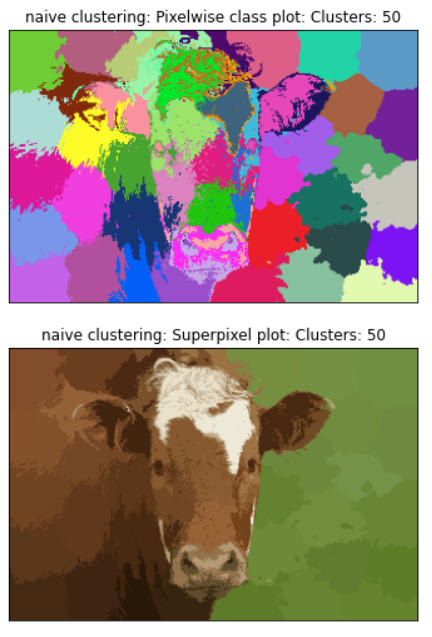
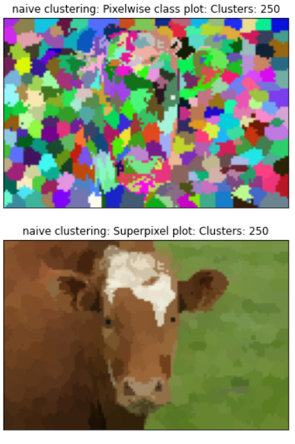

# Kmeans-Slic-Superpixel-Implementation

A superpixel can be defined as a group of pixels that share common characteristics (like pixel intensity). Superpixels are becoming useful in many Computer Vision and Image processing algorithms like Image Segmentation, Semantic labeling, Object detection and tracking etc because of the following:

- They carry more information than pixels.
- Superpixels have a perceptual meaning since pixels belonging to a given superpixel share similar visual properties.
- They provide a convenient and compact representation of images that can be very useful for computationally demanding problems.

## For this project we implement the following (reference [paper](https://github.com/savnani5/Kmeans-Slic-Superpixel-Implementation/blob/main/SLIC_Superpixels.pdf) for slic):
  
   Original Image
  
   

- Kmeans Clustering on RGB (3 channel) image

  
  
- Kmeans clustering on RGBXY (5 channel) image

  

- Kmeans clustering on RGBXY image with custom distance metric
  
  

- SLIC superpixel algorithm with LABXY (5D space) vector
  
  

- Finally we enforce connectivity for the superpixels 
  
  
